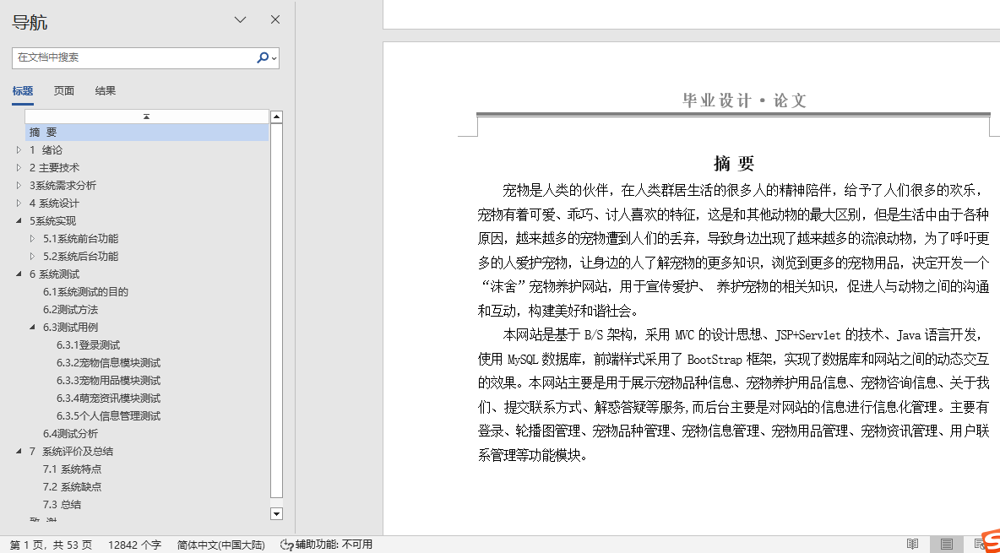
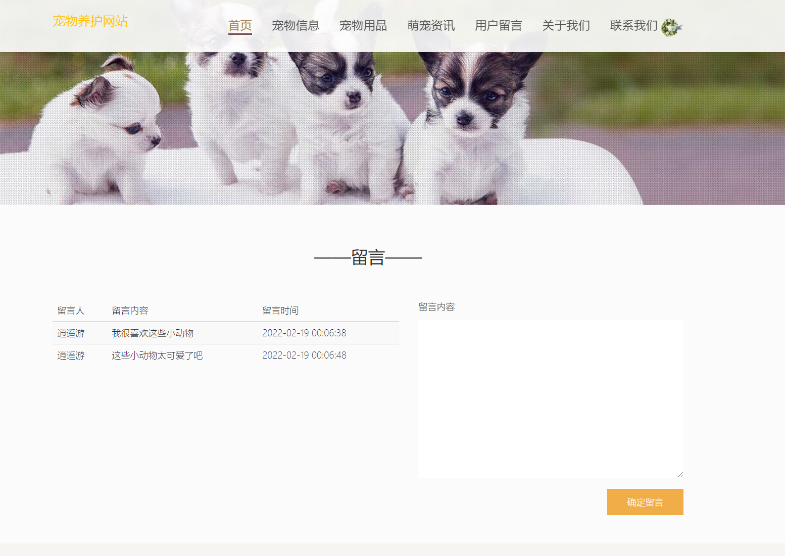
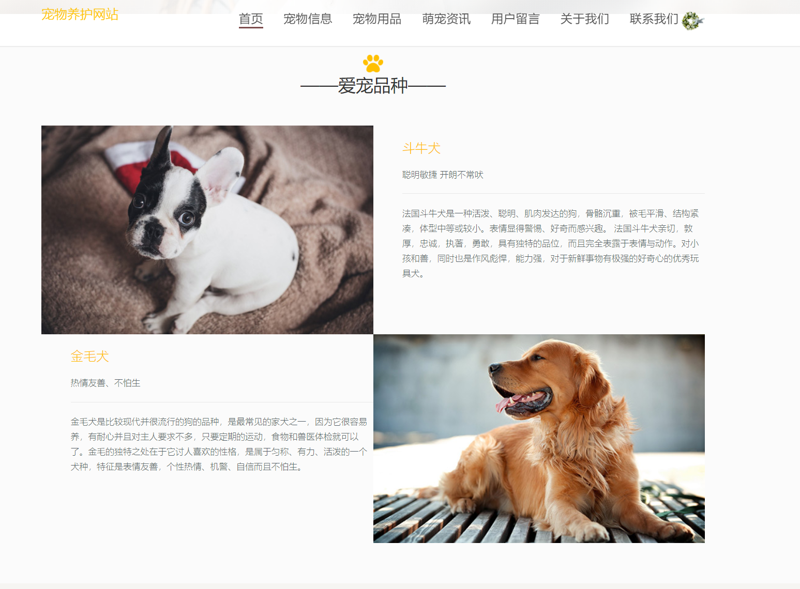
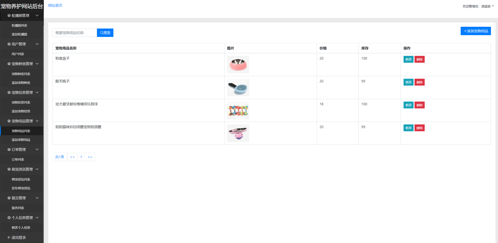
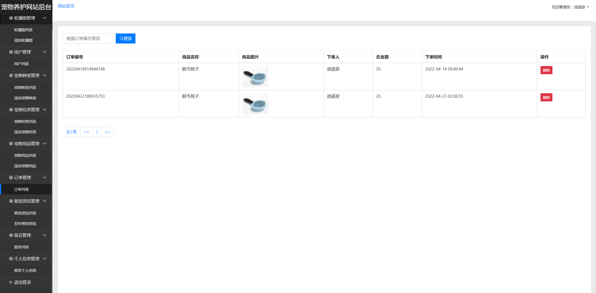
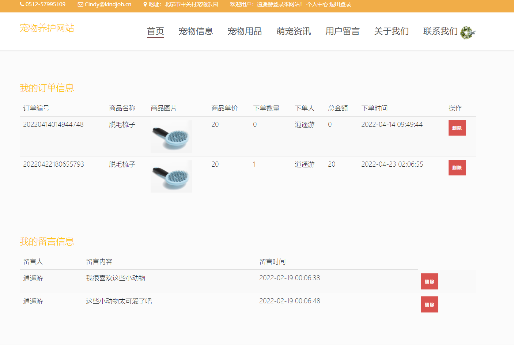

## 基于JSP+Servlet的宠物养护网站(程序+报告)

###  获取sql数据库文件: 从戎源码网 (https://armycodes.com/) QQ: 386869957 QQ群: 377586148
###  所有系统地址: (https://github.com/YuLin-Coder/AllProjectCatalog) 
###  所有项目以及源代码本人均调试运行无问题 可支持远程安装部署调试、定制修改、代码讲解

## 项目介绍
基于JSP+Servlet的宠物养护网站，系统分为用户和管理员两个角色，主要功能如下

【用户】：首页、注册登录、宠物品种信息、宠物养护用品信息、宠物咨询信息

【管理员】：登录、轮播图管理、宠物品种管理、宠物信息管理、宠物用品管理、宠物资讯管理、用户联系管理等功能模块

## 项目技术
- 编程语言：Java
- 数据库：MySQL
- 前端技术：Bootstrap、JSP
- 后端技术：Servlet、C3P0

## 运行环境
- JDK版本：JDK1.8及以上
- 开发工具：IDEA、Ecplise、Myecplise都可以
- 数据库: MySQL5.7及以上

## 运行截图

